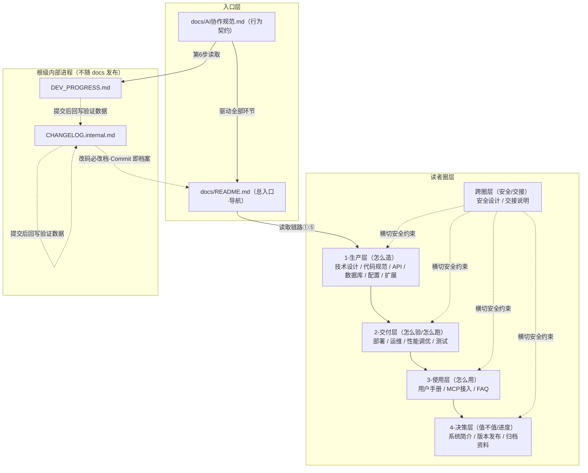

# CodeSchema 文档体系关系

> 写给谁：所有读者，尤其新接手的开发 / AI 编程工具
> 写什么：docs/ 各文档的**层次结构、读取链路、同步与归档规则**，一图看懂"谁跟谁有关"
> 配套：本页是 [docs/README.md](./README.md)（导航）的关系视图；切入口总览仍先读 README
> 核心原则：AI 先读 README → 按读取链路下钻；改码必改档；内部进程文档不随 docs 发布
> 优先级：P0
> 最后更新：2026-08-17

---

## 一、总览关系图

> 说明：实线为主读取链路与层级递进；虚线为横切约束与内部进程关联。`P8-阶段总结`
> 等开发阶段实现细节已归档至 `1-生产层/开发文档/`，与 `modules/P8.md`（公共模块拆解）职责不重叠。

## 二、读取链路（AI 启动时自上而下）

| 顺序 | 文档 | 获取内容 |
|---|---|---|
| 1 | [docs/README.md](./README.md) | 系统定位、圈层导航、更新规则 |
| 2 | [docs/1-生产层/技术设计文档.md](./1-生产层/技术设计文档.md) | 架构、模块划分、数据流 |
| 3 | [docs/1-生产层/代码规范与开发指南.md](./1-生产层/代码规范与开发指南.md) | 命名、目录、分支、commit |
| 4 | [docs/1-生产层/API文档.md](./1-生产层/API文档.md) | 接口约定（涉接口才读） |
| 5 | [docs/1-生产层/数据库设计.md](./1-生产层/数据库设计.md) | 表结构、DDL（涉存储才读） |
| 6 | `DEV_PROGRESS.md` / `CHANGELOG.internal.md` | 近期进度、历史坑 |
| 7 | 当前任务卡 / Issue | 本次目标、验收标准 |

> 完整约束见 [AI协作规范.md](./AI协作规范.md) §1；涉配置/扩展再看 `配置参考.md`、`扩展指南（新增适配器）.md`。

## 三、各圈层职责速查

| 圈层 | 目录 | 读者 | 一句话职责 |
|---|---|---|---|
| 生产层 | `1-生产层/` | 开发 / 技术负责人 / AI 工具 | "怎么造"——架构与实现规范 |
| 交付层 | `2-交付层/` | 测试 / 运维 / 产品 | "怎么验 / 怎么跑"——部署与保障 |
| 使用层 | `3-使用层/` | 使用者 / 运营 | "怎么用"——操作与接入 |
| 决策层 | `4-决策层/` | 客户 / 管理者 | "值不值 / 进度"——定位与发布 |
| 跨圈层 | `跨圈层/` | 安全 / 后续维护者 | "安不安全 / 怎么接手"——横切约束 |

## 四、更新与共享规则（改码必改档）

- 改动代码 → 按 [AI协作规范.md](./AI协作规范.md) §4「变更类型 → 文档」映射同步更新，与代码**同次提交**。
- `docs/4-决策层/版本发布说明.md` 为模板，首个正式条目待发布流维护。
- 本关系图自身也是文档：当**文档结构发生调整**（新增/迁移目录、新增主档）时，须同步更新本图，并登记至 `docs/README.md`「修订记录」。
- 归档材料（`4-决策层/归档资料/`）为只读历史源档，不作为主维护对象。

## 五、与内部进程文档的关系

- `DEV_PROGRESS.md`、`CHANGELOG.internal.md` 属**根级内部进程文档**，不随 docs/ 发布；AI 在读取链路第 6 步读取。
- 每次提交后，核心改动、验证数据（内存/P95/打点）、遗留 TODO 回写 `CHANGELOG.internal.md`，用于内部追溯复盘。

## 六、修订记录

| 日期 | 说明 |
|---|---|
| 2026-08-17 | 初始建立，承接 docs/ 分层体系，固化五个圈层与读取/同步/归档关系视图 |